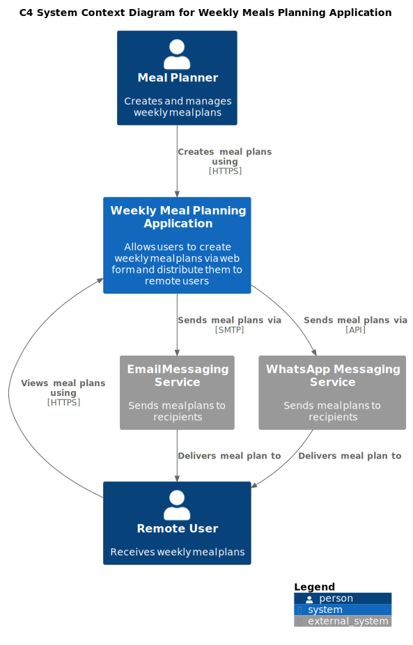

# System Design

## Introduction

### System Context

The Meal Planner application is a web-based system that allows a user to create and manage a weekly meal plan using a web form. Once the plan is completed, the system formats the information and sends it to a set of remote users through an external messaging service (e.g., WhatsApp). Remote users can also view the plans by logging into the web application.

The diagram below shows the system boundaries and its interactions with external actors. The Meal Planner User interacts directly with the web application to define the meal schedule, while remote users receive the final plan as a message and do not interact with the system directly. Message delivery is delegated to an external messaging platform, which abstracts communication details and enables reliable distribution of the meal plan.

**Meal Planning Application - System Context Diagram**

This C4 Context diagram illustrates the high-level system landscape for the Meal Planning Application. The diagram shows two primary user roles: the Meal Planner who creates and manages weekly meal plans through a web interface, and Remote Users who receive and view these plans. The core Meal Planning Application integrates with several external systems for distributing meal plans. Communication between different users and the application occurs over HTTPS, ensuring secure data transmission.
